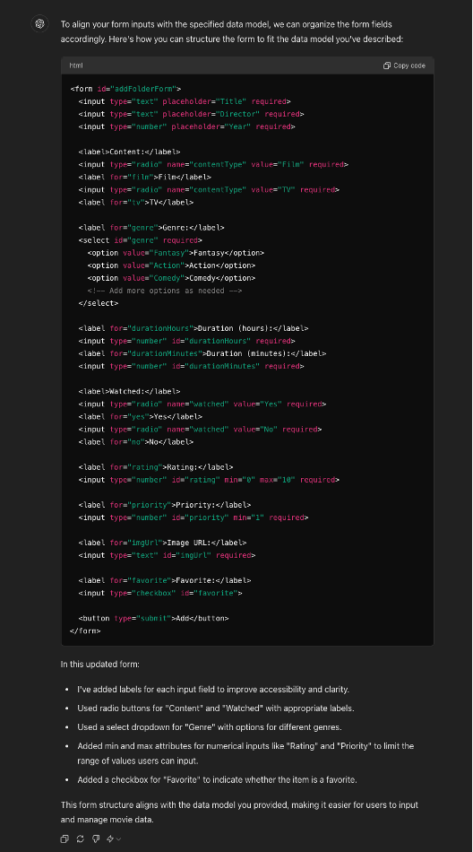
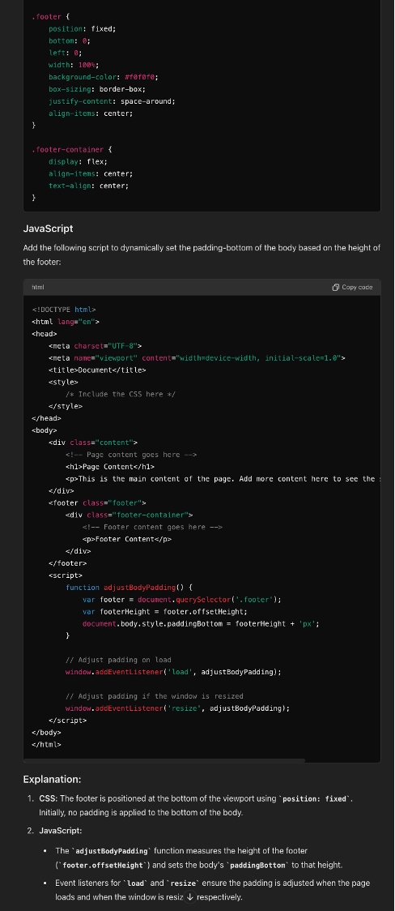
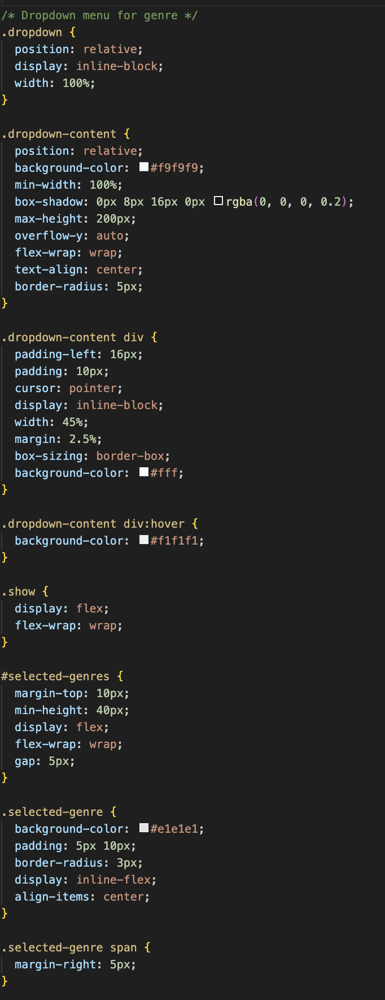

# React + Vite

This project is created with Vite and React. React provides a good template for creating single-page applications, which is why I have chosen this framework.

To run the application on your machine, execute the following command in a terminal:

```bash
npm run dev
```

Hopefully I get the github pages to run at: https://8rageramberg.github.io/myfilmratings/. I am currently trying my best to link it to the custom domain name myfilmratings.store, but I am encountering some issues. And the adjusting of DNS can take up to 24 hours to complete.

# Changes made from proposal to prototype: 
There is quite a few changes to the prototype, both for visual appeal and for functionality.

As SPA is one of the criterions leading me to refactor my code into react. This took a lot of effort but it was nice for structuring the application. The new way where you manages states and the divs are replaced is great for changing out parts of the webpage without having separate html files, and all in all is a good way to create SPA. I tried my best to avoid window reload, it took some time before I realised how to work around it. I believe I found good solutions to problems and all follow a lot of the best practice principles of react. 

# The Footer
The footer is a big part of the functionality for the new application. The footer is always placed at the bottom securing an easy reach on mobile phones at all times. The buttons are enlargened and I have also taken in the tips from my grader about "happy paths" putting add to the right and back and delete on the left side"

## The Search Bar
The search bar has replaced the sort functions. As I am quite new to React, implementing sorting buttons to allow selection of different sorting criteria was challenging and time-consuming. Due to time constraints, I focused on the search functionality. The search button, however, works with almost all the intended sorting steps. In the future, I would like to add sort functionality that lets you sort by ascending or descending priority, ratings, and other criteria.

## Settings

Settings allow the user to customize and create a more personalized experience. In the early phases of development, I included information about commands and a film reset button. This did not translate well into React at the time and was deprioritized. In the future, I would like to add features such as dark mode, color schemes, a functional option to delete all local storage data, and other fun settings for users. This was also deprioritized as I focused on optimizing the user experience for mobile phones and smaller screens, which rely on touch, making commands less applicable.

## Add Site

The add site feature is optimized for cellphone use and now has larger buttons for easier interaction.

## Cards

The cards are improved to fit nicely on both desktop and mobile displays. They are centered on the page and flexible to different screen sizes at all times. The cards now have a left side and a right side, which is a significant improvement from the initial proposal. This new design is more visually pleasing and promotes the enhanced selecting system.

## Selecting System

The selecting system initially used smaller checkboxes. Now, the entire card acts as a checkbox. The selecting system marks cards and allows users to delete or edit them depending on the number of selected cards. This system is simple for users on both desktop and mobile, as the cards act as large buttons.

## Edit System

The edit system allows users to update a card. When a card is selected, users can edit it using an edit handler. The add site form now has prefilled inputs based on the original card the user wanted to edit.


## Style

For style I tried matching visualy pleasing colours together, and for buttons I went for some colour changes on both hover and functionality. For font I went for an old american typewriter look and all in all I tried to make it as simplistic as possible with a bit of visually leading colours.

## Use of Generative AI

I used Chat GPT (free version: June 3, 2024) for various tasks during this assignment. The AI is great for explaining code and providing strategic suggestions for coding. Since I am new to React, I often asked how different sections would work together and sought advice on using states and effects.

However, it was sometimes difficult to get the AI to understand the parent-child relationship, and in some cases, it led me in the wrong direction. Many prompts involved code I had already written and needed adjustment. Usually, it was just minor changes and syntax errors. I have stored more replies from GPT, but many of those are no longer in use as I progressively learned more about React and found better solutions.

Here are a few prompts appliccable to show: 


# Prompts and replies
Reason: I had already created the form in javascript but I needed to refactor it to react. Changes were made to fit my application later. 
prompt: Prompt:  “fix my form to fit my data model”

 <!-- Input fields --> <form id="addFolderForm"> <input type="text" placeholder="Name" required> <input type="text" placeholder="Director" required> <input type="text" placeholder="Year" required> <button type="radio">Film/TV</button> <input type="text" placeholder="Genera" required> <input type="number" placeholder="Length" required> <input type="text" placeholder="Seen" required> <input type="number" placeholder="Rating" required> <input type="number" placeholder="Numer Priority" required> <input type="text" placeholder="img url" required> <input type="int" placeholder="Favourite" required> <button type="submit">Add</button> fix my form to fit the data model: str: Title str: Di- rector int: (num input) Year boolean (radio button): Content list[str] (drop- down): Genre int, int (num input) (hours, min- utes): Duration boolean (radio button): Watched float (0- 10) (num input) / None: Rating float (0- 10) (num input): Priority boolean (press icon): favourite Batman Begins Christopher Nolan 2005 Film Fantasy / Action 2h 20min Yes 9 stars 1 Yes The Big Bang The- ory Mark Cendrowski 2007 TV-Series Comedy 20min No None 10 (top priority) Yes Looking at the data model we want to keep track of a lot of data. We need all these data for simple lookup, allowing the users to see all the features of a movie that is important. For future scalability I also envision users can select columns themselves, such as adding notes on the film, rating for music or favourite actor in the film

Reply:\





Reason: 
I wanted a simple way to fix footer height dynamicly. 
prompt:\

based of on the footer here? how can i know the height?
 .footer { position: fixed; bottom: 0; left: 0; width: 100%; background-color: #f0f0f0; box-sizing: border-box; justify-content: space-around; align-items: center; /* Center items vertically */ } body { padding-bottom: 60px; /* Adjust based on the footer height */ } .footer-container { display: flex; align-items: center; text-align: center; }

reply:\



Reason: The dropdown menu I had initially no ide how to create, but gpt provided a good starting point for me to work on and it did initially turn into what it is now. a lot of the styling is kept the same. the functionality have changed a bit

Prompt: Help me create a functional dropdown manue where you can search for the different genres, select them and show them below. 

Reply: Pretty similar to my code here:\

\


prompt: 
fix my  readme markdown to look nice, fix grammer and tell me if something needs further explaining: 
"copy paste of current Readme"


